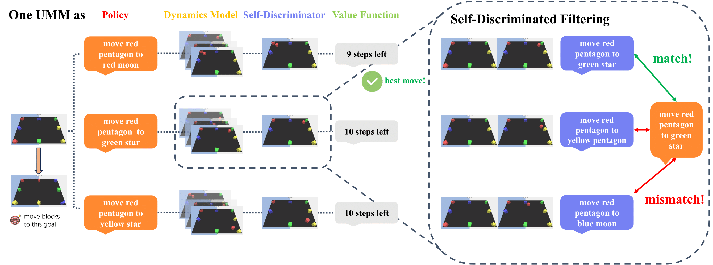
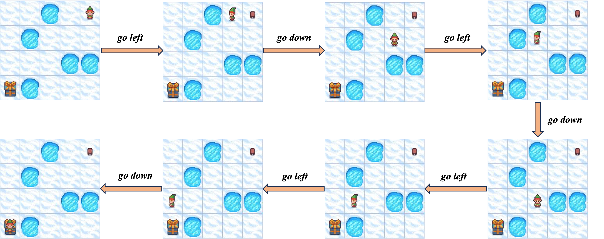
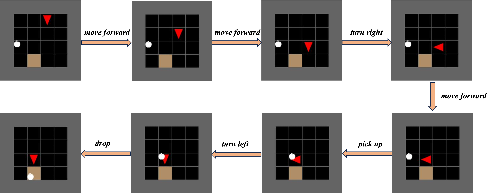
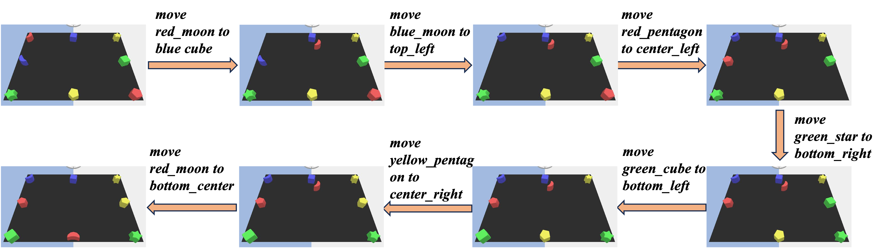

<p align="center"></p>

# Planning with Unified Multimodal Models
<a href='https://uni-plan.github.io/'></a>&emsp; <a href='https://arxiv.org/abs/2509.23014'></a>&emsp; <a href='https://huggingface.co/collections/tobealegend/uni-plan'></a>

> [Yihao Sun](https://www.yihaosun.cn/)<sup>1,2</sup>, [Zhilong Zhang](https://www.lamda.nju.edu.cn/zhangzl/)<sup>3</sup>, [Yang Yu](https://www.wolai.com/eyounx/dtR1MTyRXS5tP5Cex4KtdK)<sup>3</sup>, [Pierre-Luc Bacon](https://pierrelucbacon.com/)<sup>1,2</sup>
>
><sup>1</sup>Mila - Quebec AI Institute, <sup>2</sup>Université de Montréal, <sup>3</sup>Nanjing University
>
>  contact: yihao.sun@mila.quebec
> 
> We present **Uni-Plan**, a planning framework built upon an open‑source multimodal foundation model **BAGEL**. Within this framework, a single model simultaneously serves as the policy, dynamics model, self-discriminator and value function. 

## Overview

<p align="center">
  
</p>

## Quick Start

### Installation

The environment setup of Uni-Plan is the same as its base model [Bagel](https://github.com/ByteDance-Seed/Bagel).

```
git clone https://github.com/uni-plan/uni-plan.git
cd uni-plan
conda create -n uni-plan python=3.10 -y
conda activate uni-plan
pip install -r requirements.txt
pip install flash_attn==2.5.8 --no-build-isolation
```

If you encounter any compilation errors when installing `flash_attn`, you can install a precompiled wheel instead of building from source.

1. Go to the official release page:  
   **https://github.com/Dao-AILab/flash-attention/releases**

2. Download the wheel that matches your environment, typically:
   - **CUDA 12.4**
   - **PyTorch 2.5**
   - **Python 3.10 (cp310)**

3. After downloading the wheel, install it with:

   ```bash
   pip install <wheel_file>
   ```


### Model Download

You can download the huggingface [checkpoint](https://huggingface.co/collections/tobealegend/uni-plan) or use the following script:

```python
from huggingface_hub import snapshot_download

"""
FrozenLake: tobealegend/Uni-Plan-FrozenLake
MiniBehavior: tobealegend/Uni-Plan-MiniBehavior
LanguageTabel: tobealegend/Uni-Plan-LanguageTable
"""
save_dir = "models/Uni-Plan-FrozenLake"
repo_id = "tobealegend/Uni-Plan-FrozenLake"
cache_dir = save_dir + "/cache"

snapshot_download(cache_dir=cache_dir,
  local_dir=save_dir,
  repo_id=repo_id,
  local_dir_use_symlinks=False,
  resume_download=True,
  allow_patterns=["*.json", "*.safetensors", "*.bin", "*.py", "*.md", "*.txt"],
)
```

### Planning Inference
Run script `eval/bagel-plan/{task_name}/eval_planning.py` for planning. You should specify your local checkpoint path.
Note that you need at least one GPU with 40GB or more VRAM to run the inference.

## Planning visualizations for different tasks

<p align="center">
  
</p>
---
<p align="center">
  
</p>
---
<p align="center">
  
</p>

## Finetuning on your own dataset

1. For dynamics finetuning, you need to construct your data as the following jsonl file.
```json
{"id": 0, "images": ["step_0.jpg", "step_1.jpg"], "action_sequence": ["action_0"]}
```
Here the length of images list should be euqal to the length of action_sequence + 1. If you don't want history context for dynamics prediction, the length of images list will be 2.

2. For finetuning other roles (policy, value, inverse dynamics), you can follow the vlm data format to construct your data.
```json
{"id": 0, "image": "img_0.jpg", "conversations": [{"from": "human", "value": "<prompt>\n<image>"}, {"from": "gpt", "value": xxx}]}
```

3. Configure your data at  `data/configs/example.yaml` and  `data/data_info.py`

4. Run script `scripts/train_example.sh`. You need at least 8 GPUS where each one has at least 80GB VRAM  to train this model.

## Citation

```bibtex
   @misc{
      sun2025planningunifiedmultimodalmodels,
      title={Planning with Unified Multimodal Models}, 
      author={Yihao Sun and Zhilong Zhang and Yang Yu and Pierre-Luc Bacon},
      year={2025},
      eprint={2509.23014},
      archivePrefix={arXiv},
      primaryClass={cs.CV},
      url={https://arxiv.org/abs/2509.23014}, 
   }

```

## Acknowledgement

- [Bagel](https://github.com/ByteDance-Seed/Bagel) proposed by ByteDance-Seed team. It makes our idea happen!
